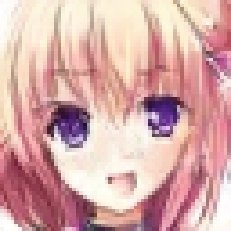

#  Anime Face Generator

This project applies a **Vanilla DCGAN to generate Anime faces**, utilizing TensorFlow to build and train the model. The goal is to create high-quality anime faces by leveraging the power of convolutional layers in both the generator and discriminator.

    

## Table of Contents
- [Framework](#Framework)
- [Dataset](#Dataset)
- [Pre-processing](#Pre-processing)
- [Architecture](#Architecture)
- [Results](#Results)

This is an academic project to conclude **LAMIA's Machine Learning Bootcamp**, which involves applying a simple DCGAN architecture to generate Anime girl faces.  
DCGAN (Deep Convolutional Generative Adversarial Network) is a GAN architecture that uses deep convolutional layers in both the generator and discriminator. In a GAN, the discriminator tries to identify whether an image is real or generated, while the generator tries to deceive the discriminator into classifying the generated images as real. The DCGAN works in the same way but uses convolutional layers.
This architecture was chosen for its ability to learn complex data patterns and **generate high-quality images**.

## Framework

**Tensorflow** was chosen for its optimization and compatibility with a wide range of techniques and technologies. Since a GAN cannot be trained using the `Sequential.fit()` method, Tensorflow is very useful for customizing the model training step and process, including dataset handling, optimizations, and others tools.

## Dataset

The dataset used for this project is the [Anime Face Dataset](https://www.kaggle.com/datasets/splcher/animefacedataset), containing **63,632 images** with a **256x256** resolution, all scraped from [Getchu](www.getchu.com).  

### Pre-processing

The dataset was created for the goal *"I just want to generate perfect waifus"*. So, the images don't have labels and are stored in a single directory.  
The method `tensorflow.keras.utils.image_dataset_from_directory()` was used to create a dataset with the following properties:
- Images resized to **64x64**, balancing quality and computational efficiency during training.
- **64 images per batch**.
- The batches are shuffled every step.
- Images **normalized to the interval [-1, 1]**.
- 2 batches preloaded to optimize reading time.

## Architecture

The architecture used here is a simple DCGAN.
- The generator have **4 deconvolution layers**, and the discriminator have **4 convolution layers**. Both use a `stride = 2` instead of pooling layers to optimize the training time.
- **Batch normalization** is aplied in each layer of the generator and discriminator (except the output layer). This helps to stabilize and accelerate the training by normalizing the activations from the previous layer. This reduces the internal covariate shift, improving the model’s ability to learn and generalize better, and prevents overfitting.
- `LeakyReLu` is used on Deconvolution, Convolution and input layers to aviod *dead units* (commom problem in deep networks).
- `tanh` is used as the final activation of the generator because it return values between 1 and -1, which is consistent with the normalization of the input images.
- `sigmoid` used as the final activation of the discriminator. (return values between 0 and 1).
- 25% of **Dropout** is added to the two middle convolutional layers of the discriminator. This helps prevent overfitting by randomly disabling 25% of the neurons during each training step, forcing the model to learn more robust and generalized features.
### Aditional features
To maximize the learning of both the generator and the discriminator, two additional features were added to the training process:
1. The **discriminator runs twice on the real images per batch** in each n epoch(s).  
~~2. In every n epochs, the learning rate of both is adjusted based on their loss mean.~~

## Results

In GANs, **visual results are often more important than traditional metrics** because the primary goal of the model is to produce outputs that closely resemble real data, which is best evaluated qualitatively. However, monitoring losses during training remains crucial for assessing the convergence and balance between the discriminator and generator. From my training observations, the balance between the losses has proven to be more significant than their absolute convergence.

During the initial epochs, the loss disparity between the two models is often substantial and unstable. Over time, these losses typically stabilize and approach similar values, often oscillating around 1. Nevertheless, this behavior is not guaranteed, as various factors — including the architecture, dataset, and training parameters — can influence the dynamics.

Accuracy can also serve as an additional metric to gauge the interaction between the models. Ideally, the discriminator's accuracy should hover around 50%, reflecting a well-balanced GAN where the generator is producing realistic images that sufficiently confuse the discriminator.

### **Metrics Graph**

    

### **Generated Images**

    

